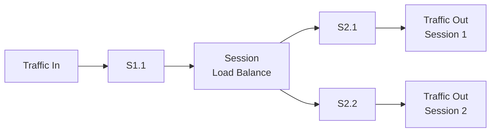

# Traffic Distribution

This case study shows how to distribute incoming traffic from one input port to multiple output ports using load balancing.

## Flow



## Configuration

```xml
<run>
	<chain>
		<in>S1.1</in>
		<out type="loadBalance" lbtype="5thash">S2.1,S2.2</out>
	</chain>
</run>
```

## Behavior

- **Input**: Packets enter the chain from port `S1.1`.
- **Output (load balance)**: Packets are forwarded to one of the output ports listed in `<out>`: `S2.1` or `S2.2`.
- **Hash method (`5thash`)**: The device computes a hash based on the 5-tuple (source IP, destination IP, source port, destination port, L4 protocol) to determine the output port.
- **Session/flow consistency**: Packets belonging to the same session/flow are forwarded to the same output port, keeping packet order consistent within that flow.

